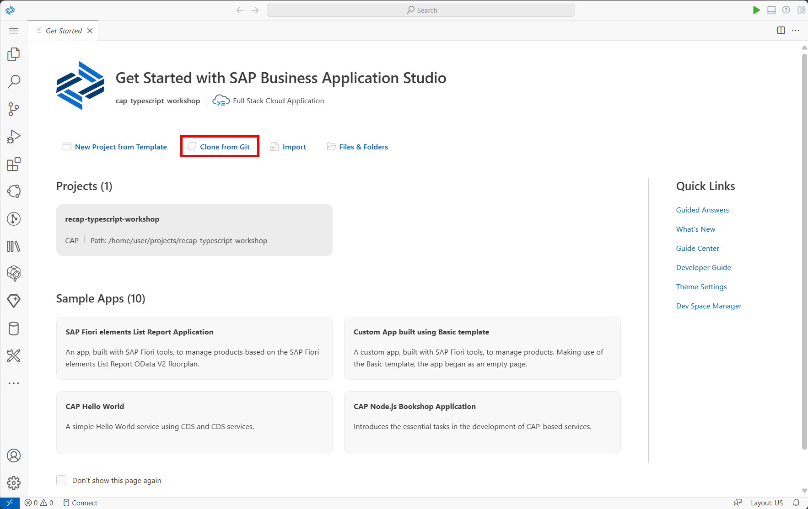
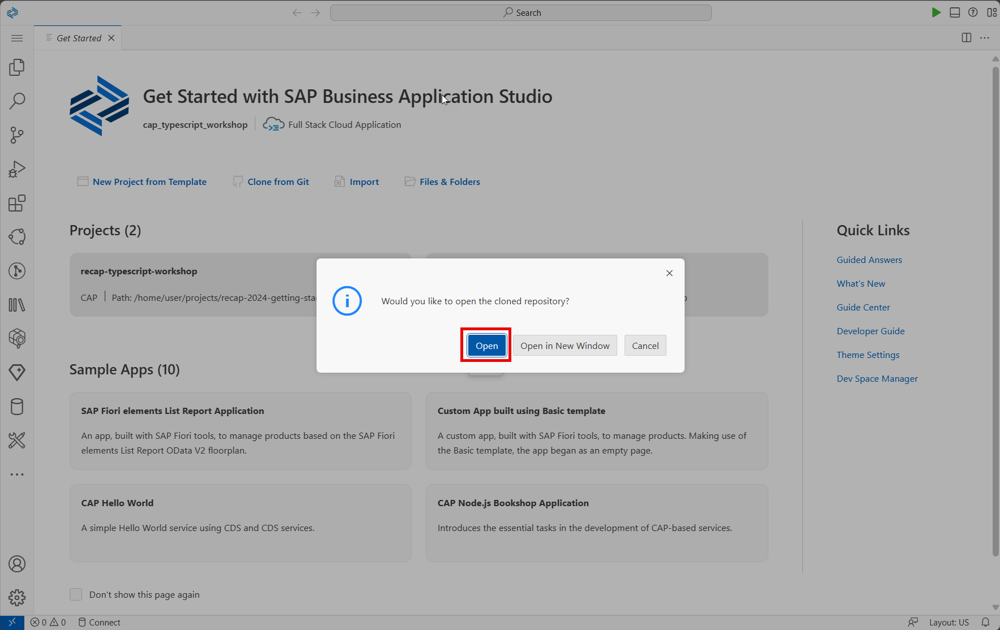
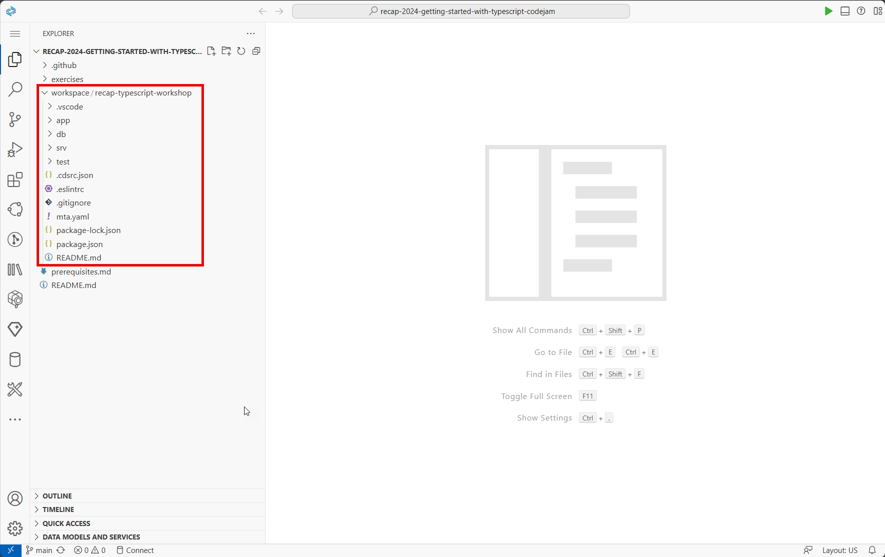
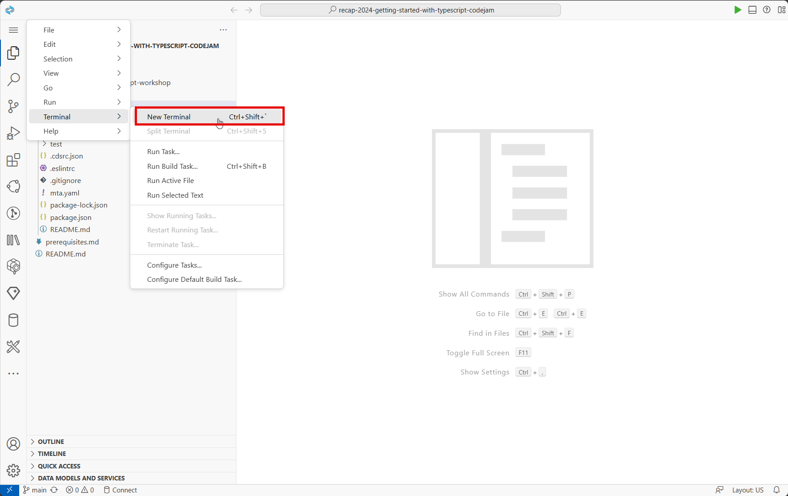
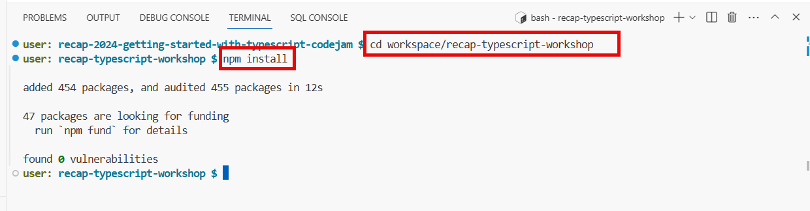
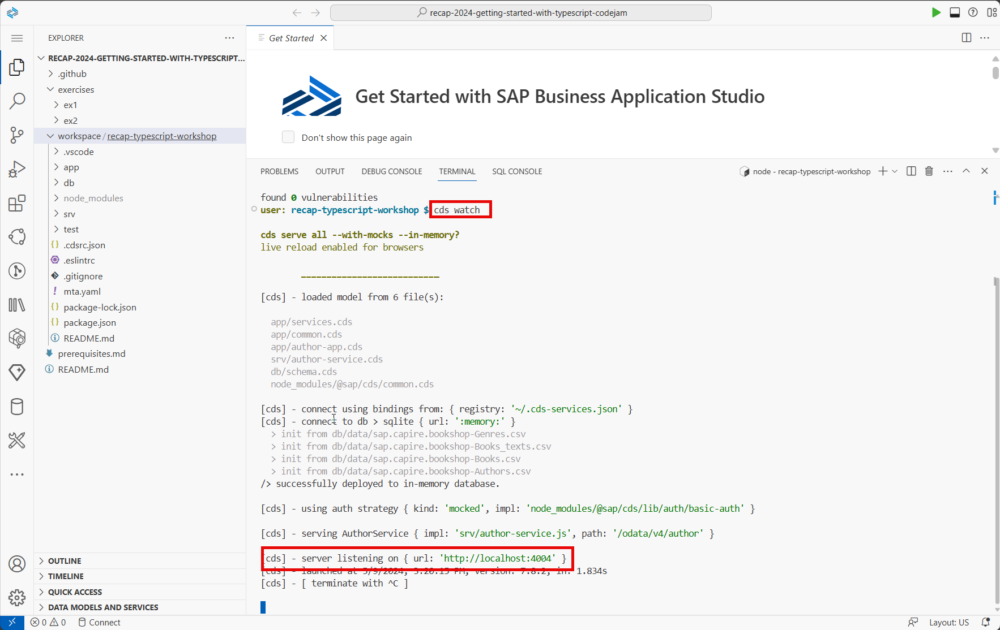
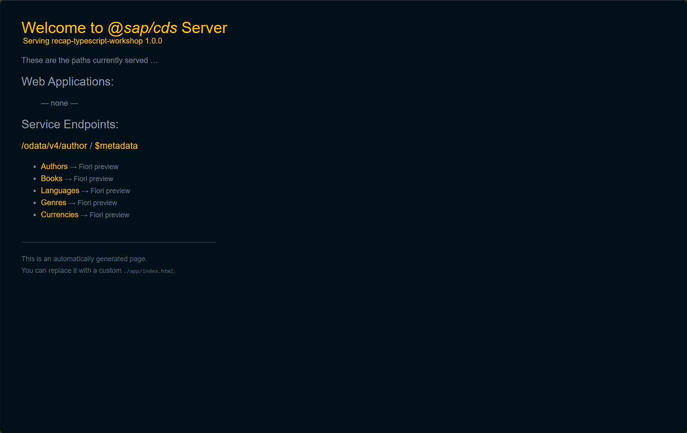
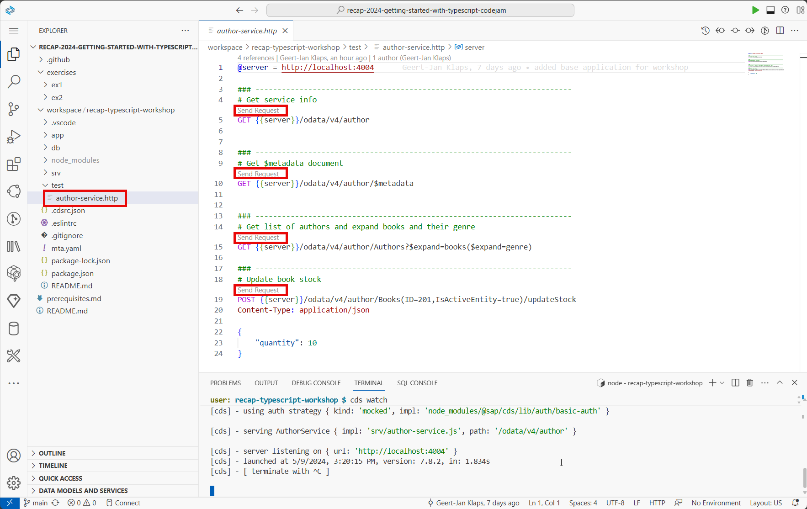

# Cloning the exercise repository & running the base project

During this session we'll be working on an existing project which contains a basic data model and an existing service implementation in JavaScript. In this session we'll transform the existing JavaScript implementation into TypeScript and an SAPUI5 application to the project (also using TypeScript).

👉 Start by cloning this repository into your local Business Application Studio workspace.

👉 Enter the repository URL: https://github.com/geert-janklaps/recap-2024-getting-started-with-typescript-codejam.git .

👉 When asked to open the cloned repository, confirm using the "Open" button. 

👉 Open the workspace folder & underlying project "recap-typescript-workshop".
    
👉 Explore the db folder to get an understanding of the existing datamodel.

👉 Explore the srv folder to get an understanding of the existing service implementation.

👉 Open a new terminal

The terminal will open in the root of the cloned repository. During the session we'll want to execute all commandline commands in the actual project folder. 

👉 Change the terminal folder location with following command

    cd workspace/recap-typescript-workshop

👉 The cloned project only contains the actual project, to get started we need to install the project to get all re-used projects / dependencies from the package manager (default npmjs). Do so by executing the install command

    npm install

👉  We're all set to launch our project & start testing our existing logic, launch the project by running the watch command and wait for the server to start

    cds watch

👉  Open the server url by using ctrl + click (cmd + click on mac)

👉  Open the author-service.http file and try-out some of the requests by clicking the "Send Request" buttons

