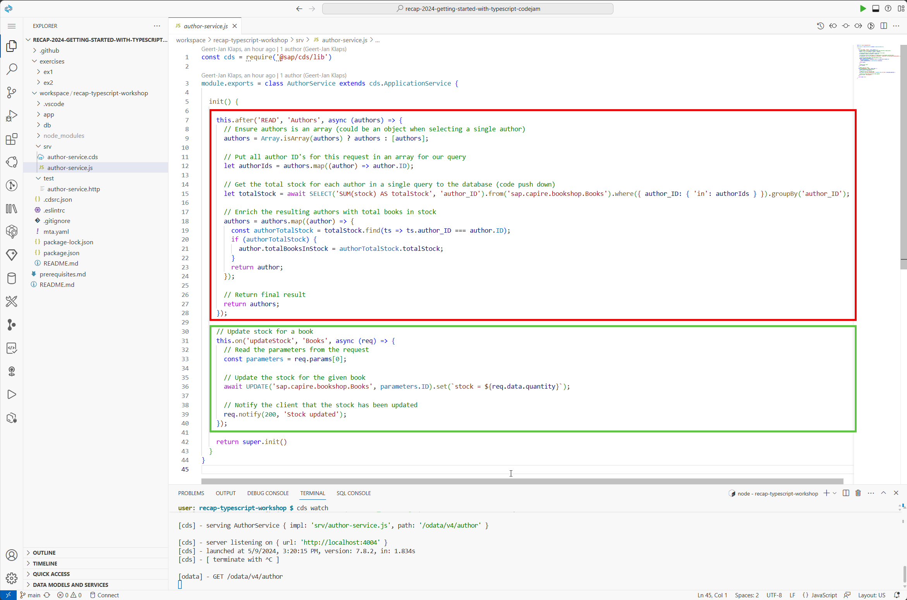
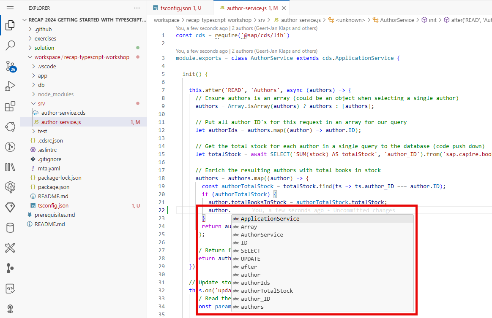
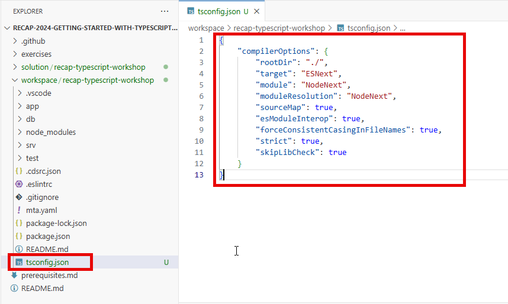
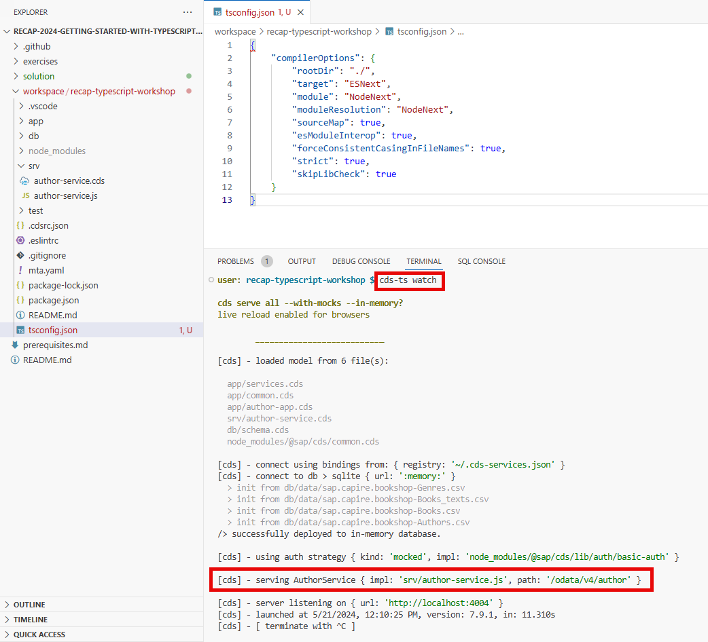
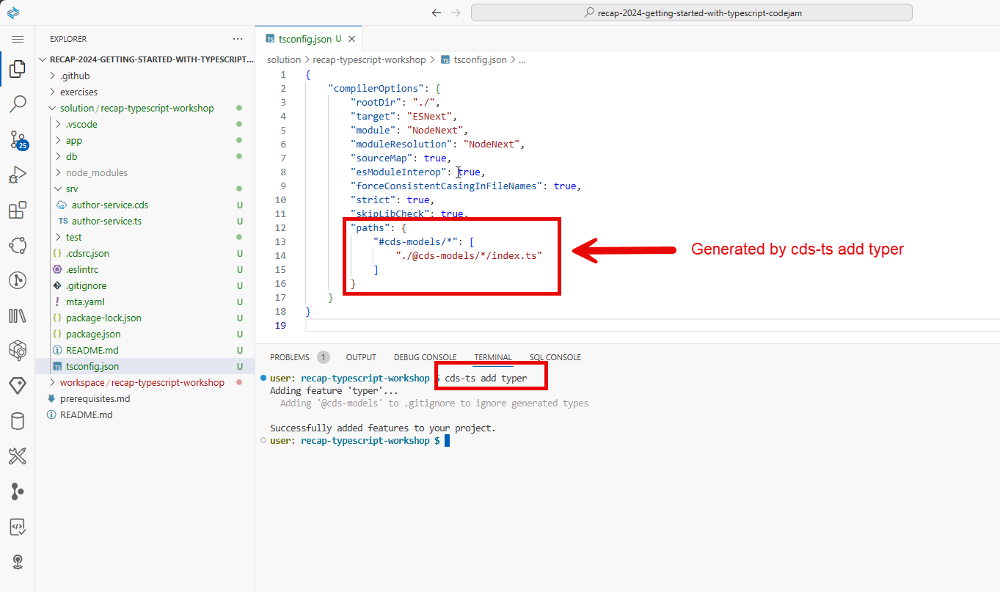
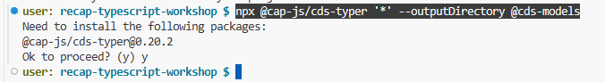
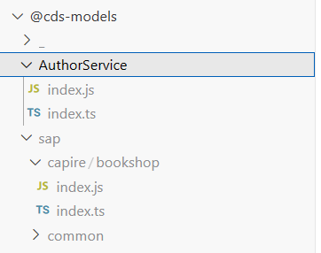

# Transforming the sample project to TypeScript

## Reviewing the current service implementation

Currently our service implementation is written in JavaScript. In the sample project, there are two handlers registered on two different entities of the service.

- After read handler for entity Authors (calculates the total amount of books in stock for an author and updates the virtual field totalBooksInStock)
- On updateStock handler for the action registered on entity books (the action allows us to update the stock of a book by providing the parameter quantity)



👉 Before enabling TypeScript in the project, try out the current code assistance options. You'll notice as in below example there's actually no real code assistance, just some suggestions.



## Enabling TypeScript for our project

Enabling TypeScript for a project is quite easy, the TypeScript compiler only needs a tsconfig.json file in the root of the project.

👉 Create a new file called tsconfig.json in the root of the project

👉 Copy below configuration in the file and save

```json
{
    "compilerOptions": {
        "rootDir": "./",
        "target": "ESNext",
        "module": "NodeNext",
        "moduleResolution": "NodeNext",
        "sourceMap": true,
        "esModuleInterop": true,
        "forceConsistentCasingInFileNames": true,
        "strict": true,
        "skipLibCheck": true
    }
}
```



## Running the project with TypeScript

👉  We're all set to launch our project & start testing our existing logic with TypeScript, launch the project by running the watch command and wait for the server to start (notice the slightly changed command cds -> cds-ts)

    cds-ts watch



Notice that the cds-ts command still loads the original JavaScript implementation? That's because we didn't change our implementation to TypeScript yet. We'll do so in the next chapters.

👉 Terminate the running server with CTRL + C (or CMD + C on MacOS)

## Adding the CDS typer to the project

Since we're going to use TypeScript, we'll need to create types for our existing data model / services. Sounds like a lot of work right?

Good news! SAP provides the [CDS typer](https://cap.cloud.sap/docs/tools/cds-typer) package to generate types for our data model & services! Let's go ahead and install the CDS typer package!

👉 Install the CDS typer with following command

    cds-ts add typer

Notice how our previously created tsconfig file is extended with additional information (location for our generated types):



👉 Manually generate the types for the existing project with following command:

    npx @cap-js/cds-typer '*' --outputDirectory @cds-models

If the command asks to install package @cap-js/cds-typer confirm with 'y':



👉 Explore the generate files in folder @cds-models



## Changing the service implementation from JavaScript to TypeScript

