# Exercise 3 - Adding a TypeScript Fiori Elements app

## Adding a TypeScript-based SAP Fiori Elements template to our project with SAP Fiori Tools

👉 Open the "Command Palette"

👉 Open the "Fiori Application Generator"

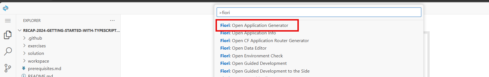

👉 Select the "List Report Page" template and click "Next"

👉 As datasource select "Use a Local CAP Project"

👉 Select the right CAP Project (the one in the workspace folder, not the solution folder!)

👉 As OData Service, select the "AuthorService" and click "Next"

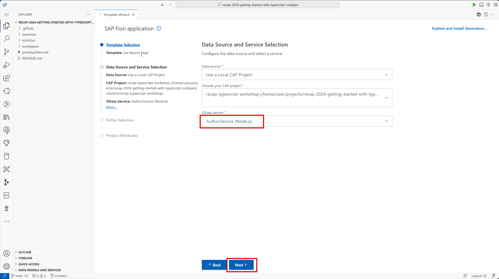

👉 Select the "Authors" as main entity

👉 Ensure the navigation entity is set to "None"

👉 Set option "Automatically add table columns to the list ... " to "No" (the base project already provides annotations to properly create a UI)

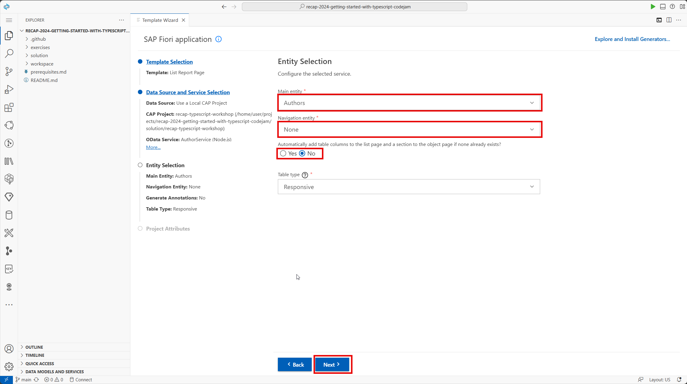

👉 Set following project attributes

| Attribute | Value |
| -------- | ------- |
| Module name | authors |
| Application title | Authors |
| Description | Display Authors |
| Add deployment configuration to MTA project | No (not needed for this workshop, since we're not focussing on the build / deployment process) |
| Add FLP configuration | Yes (important, this will be used in exercise 4 to test the application in the local launchpad) |
| Configure advanced options | Yes (allows us to select TypeScript) |
| Add code assist libraries to your project | Yes (enables code completion during development) |
| Generation of this application can update the CAP project to use NPM workspaces and an associated CDS plugin library (cds-plugin-ui5) | Yes (enables the UI5 tooling plugin for CAP, which will enable live transpilation of the TypeScript source code during development) |
| Enable TypeScript | Yes |

👉 Go to the next step by clicking "Next"

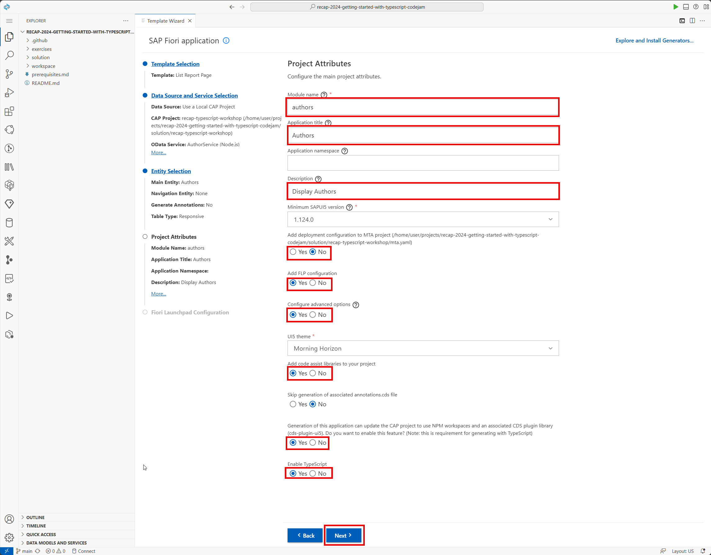

👉 Set following Fiori Launchpad Configuration

| Attribute | Value |
| -------- | ------- |
| Semantic Object | Authors |
| Action | display |
| Title | Authors |
| Subtitle | display |

👉 Click "Finish" to start the actual application generation

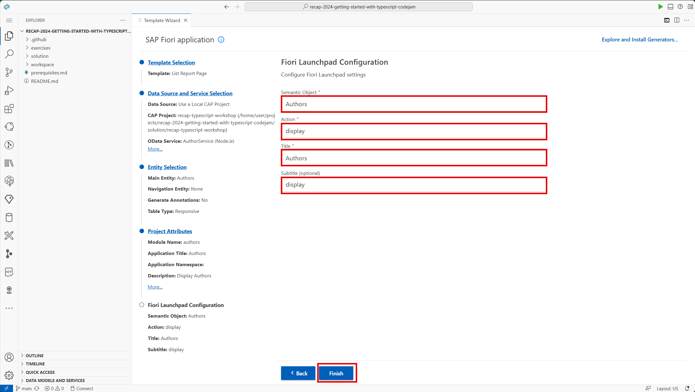

👉 Wait for the application generation to finish

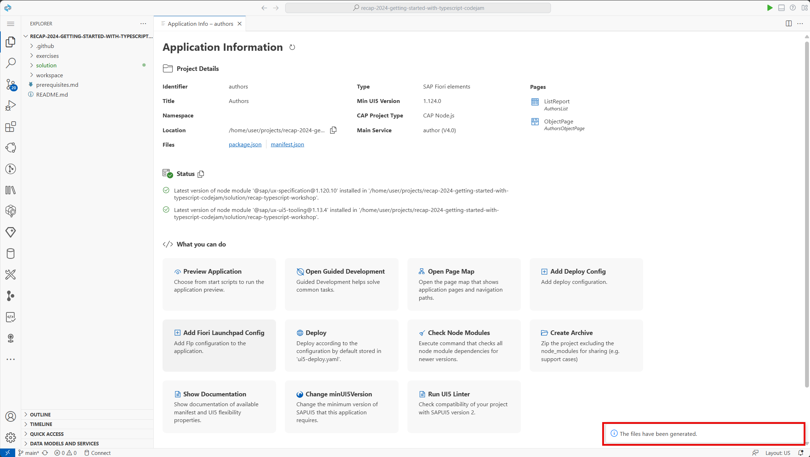

## Running our project again with TypeScript & our newly created app

👉 Explore the generated project, notice that the project is properly generated using TypeScript (Component.ts & tsconfig.json files present)

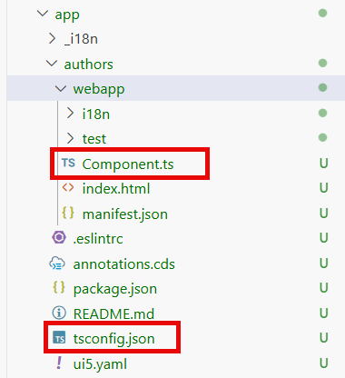

👉 Open up a new terminal window (or re-use one if you still have one open)

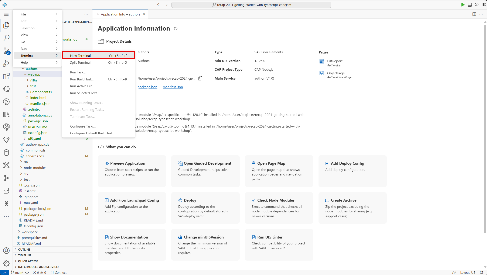

👉  We're all set to launch our project & start testing our fullstack application with TypeScript, launch the project again by running the watch command and wait for the server to start.

    cds-ts watch

👉 Notice that the CDS watch command now outputs some additional information from the cds-ui5-plugin (live reload & live transpilation enabled)

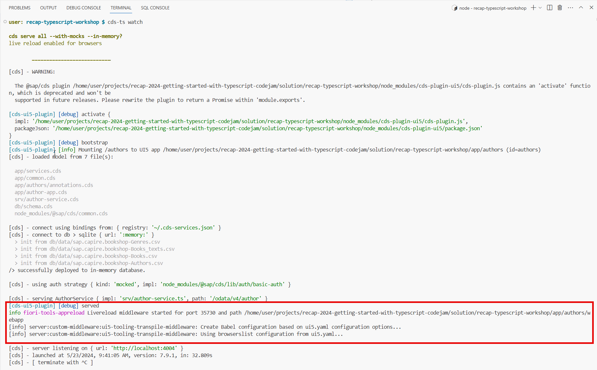

👉 Open the CAP Service & open the generated application

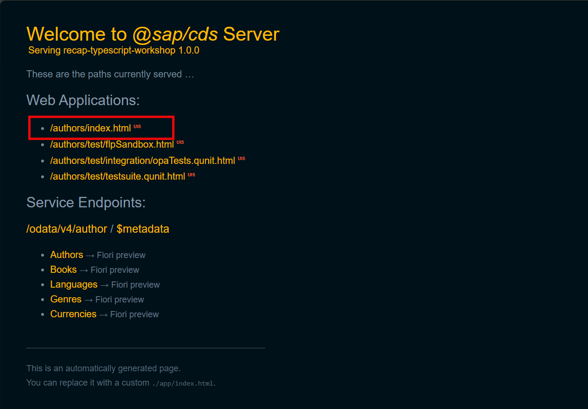

👉 Try-out the application

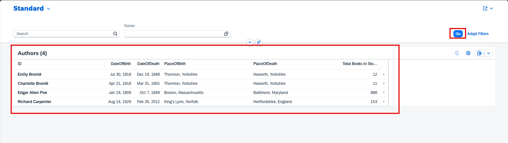