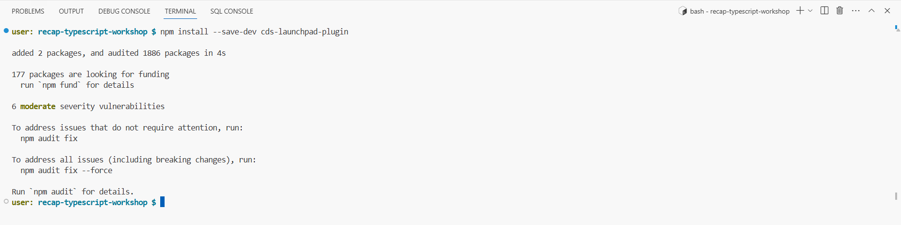
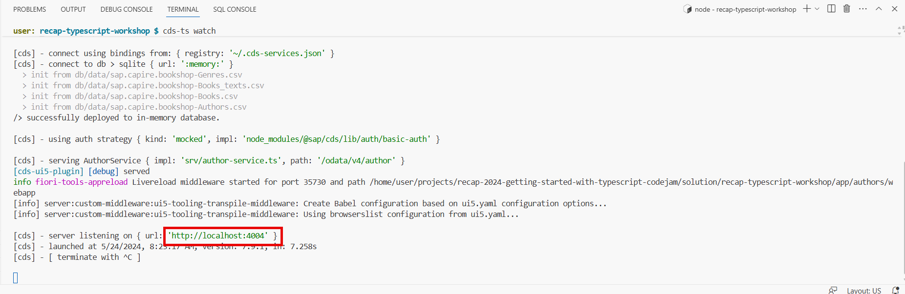
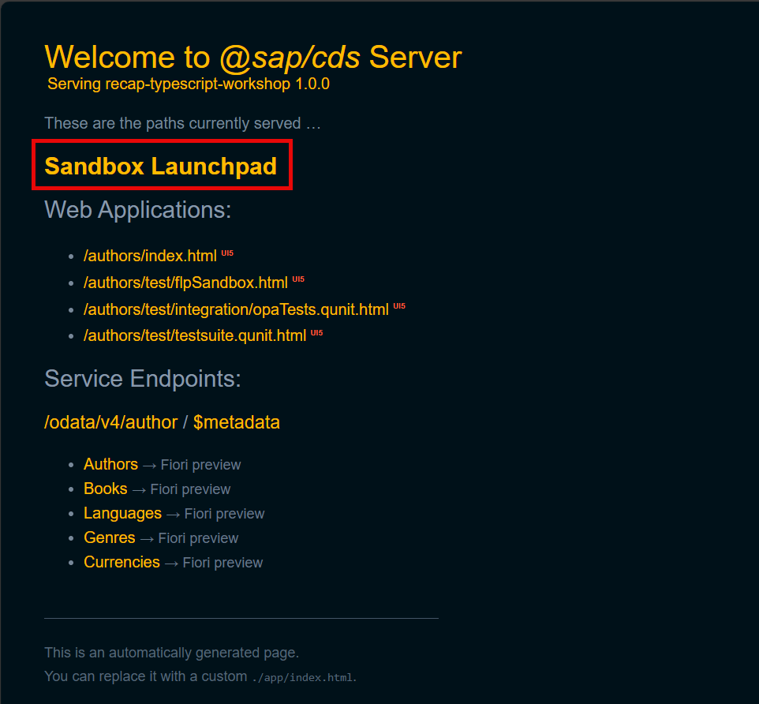
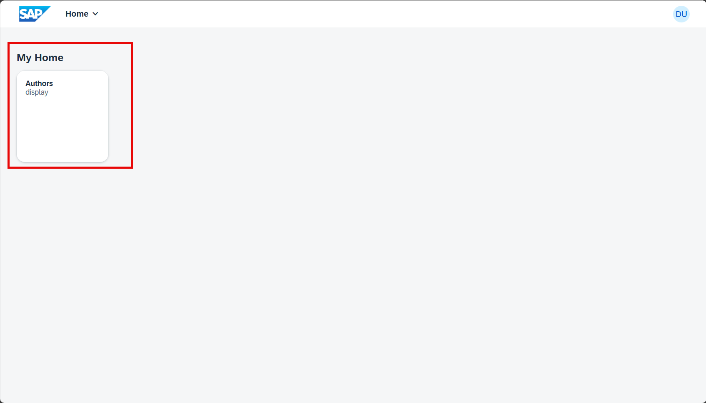
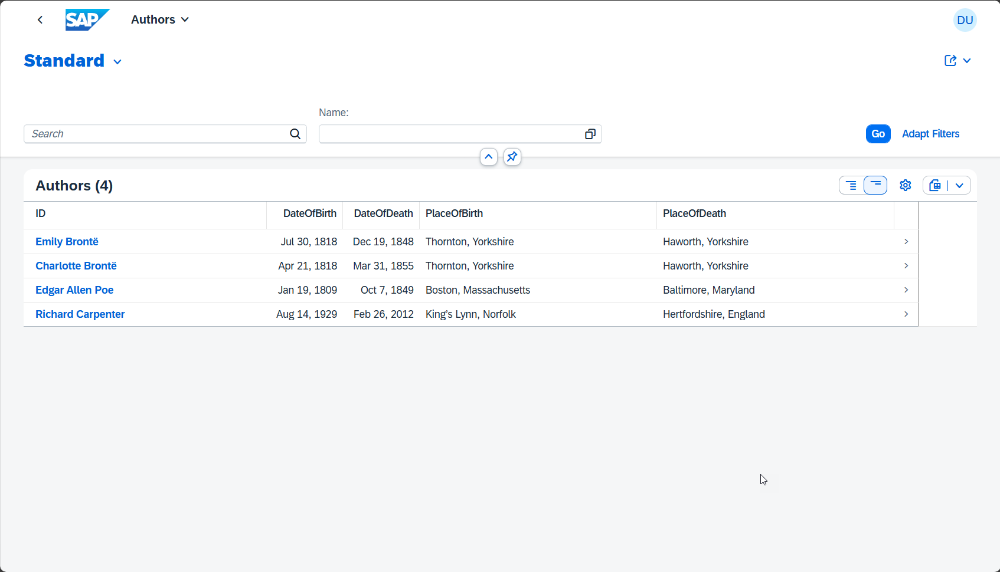

# Exercise 4 - Adding a local launchpad to test our TypeScript solution end-to-end

👉 Install the cds-launchpad-plugin by executing following command

    npm install --save-dev cds-launchpad-plugin

👉  We're all set to launch our project & start testing our fullstack application with TypeScript inside a demo launchpad environment, launch the project again by running the watch command and wait for the server to start.

    cds-ts watch

👉 Open the CAP Service & notice that we now have the "Sandbox Launchpad" available

👉 Open the Sandbox Launchpad

👉 The launchpad now contains our application generated in exercice 3

👉 Open the application and test the result

